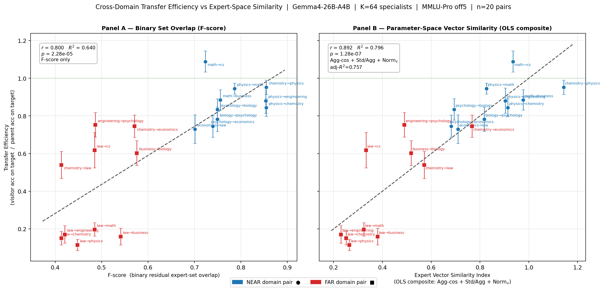

# Gemma4 College of Experts — MMLU-Pro Domain Specialists (Automated Pipeline)

**Base model:** [google/gemma-4-26b-it](https://huggingface.co/google/gemma-4-26b-it)  
**Architecture:** MoE — 26B total / ≈4B active parameters (1 shared expert + 8 routed from a pool of 128 per MoE layer, 30 MoE layers)  
**Method:** Activation-directed expert surgery — 128 → 64 experts per layer (50% reduction)  
**Quantization:** Q4_K_M (≈9.7 GB on disk)  
**Tags:** `JThomas-CoE/coe-gemma4-[domain]-mmlu_pro-14b-a4b-q4` | **Ollama:** `coe-gemma4-[domain]-mmlu_pro-14b-a4b:q4`  
**Hub:** [JThomas-CoE on HuggingFace](https://huggingface.co/JThomas-CoE)

This README covers the MMLU-Pro–derived domain specialist batch: 10 domain specialists whose activation profiling corpus was assembled automatically from MMLU-Pro questions rather than from hand-curated domain texts. The key claim this release tests is that domain-relevant expert populations can be identified using existing public benchmark questions alone, making the surgery pipeline fully automatable.

---

## ⚠️ Beta Release — Safety Disclaimer

**These models are beta releases and should be treated as research artifacts, not production-ready systems.**

Expert surgery selects and retains domain-relevant experts based on activation patterns observed during profiling. The pruning pipeline is designed solely to create a coherent domain specialist — it has no mechanism to identify which experts contribute to model alignment, ethical reasoning, or safety guardrails. As a result, experts responsible for enforcing those behaviours may have been inadvertently removed during the surgery process.

**Appropriate use of any model in the College of Experts family is the sole responsibility of the end user.** The authors make no representation that these models retain the safety properties of the parent `google/gemma-4-26b-it` model, and users should not rely on them as a substitute for models that have undergone safety evaluation.

---

## ⚠️ Critical Usage Note — Think-Off Mode

**All models in this series must be used in thinking-off mode.**

If you are using the Ollama API, pass `"think": false` in your request body. If you are accessing the model via a raw API (llama.cpp server, OpenAI-compatible endpoint, etc.) you **must inject a closed thinking block** at the start of the assistant turn:

```python
messages = [
    {"role": "system",    "content": "Your system prompt here."},
    {"role": "user",      "content": "Your question here."},
    {"role": "assistant", "content": "<think></think>\n"},   # <-- required prefill
]
```

**Why this is required:** Expert surgery retains 50% of the expert pool per layer, selecting experts that are maximally active on domain content and chain-of-thought reasoning. A side effect is that the loop-suppression experts — which activate on metacognitive closure signals near the end of a `<think>` block — do not have a concentrated domain-specific activation signature and may be disproportionately pruned. In think-on mode, this causes the model to enter a reasoning loop that exhausts the token budget without producing a final answer. In extreme cases, the loop rate is 60–70% on hard questions.

The `<think></think>` prefill works by consuming the opening `<think>` token before generation starts, so the model sees its thinking as already complete and proceeds directly to answering. This is the mechanism used in all benchmarks reported here.

**What think-off mode does not disable:** Gemma4's chain-of-thought training is deeply ingrained. Even with the think block closed, the model produces brief inline reasoning interleaved with its answer — shorter and more linear than a full scratchpad, but present. All benchmark figures in this README are measured in this constrained-implicit-CoT mode, which is more conservative than the full explicit CoT used by leaderboard entries.

### Ollama Modelfile Template

```
FROM <model_path_or_ollama_tag>

PARAMETER temperature 0.6
PARAMETER repeat_penalty 1.05
PARAMETER num_ctx 16384
PARAMETER num_predict 16384
PARAMETER think false

SYSTEM """
You are an expert [DOMAIN] practitioner.
[Domain-specific output format constraint.]
Return your complete answer, then stop with no further output.
"""
```

Temperature 0.6 is strongly recommended. Higher temperatures (≥ 1.0) materially increase loop rates in think-off mode.

---

## What Are These Models?

These models are produced by **activation-directed expert surgery** applied to the Gemma4 26B-A4B instruction-tuned model. The surgery does not change any weight values — it prunes the FFN weight tensors for experts that are not part of the domain-specialist mask, then saves the result as a smaller GGUF. The result is a model that loads 7+ GB less VRAM for 4 bit quantization than the parent while maintaining the same token throughput (active parameters per forward pass are unchanged: 9 experts fire per token regardless of pool size).

### Memory Efficiency

| Configuration | VRAM (16k ctx) | VRAM (64k ctx) | Active params |
|---|---|---|---|
| Gemma4-26B parent (Q4_K_M) | 19.4 GB | 20.5 GB | ≈4B |
| Specialist K=64 (Q4_K_M) | **12.3 GB** | **13.4 GB** | ≈4B |
| Q4 savings vs Q4 parent | **7.1 GB (37%)** | **7.1 GB (35%)** | unchanged |

All figures directly measured in Ollama. Throughput is identical between specialist and parent at the same quantization.

---

## Activation Profiling — How the Masks Are Built

### Step 1 — Corpus Assembly (Automated)

For this release, the profiling corpus was assembled automatically: a representative subset of MMLU-Pro questions for each domain was run through the parent model in forward-pass mode. The model's own responses to those questions served as the activation signal. No external domain text was curated.

This contrasts with the hand-curated pipeline (used for `coe-gemma4-physics-14b-a4b-q4`, `coe-gemma4-med-pharma-14b-a4b-q4`, `coe-gemma4-math-14b-a4b-q4` and all the prior work with the qwen3 family of models) where textbook prose, problem sets, and model-generated traces were assembled per-domain. The MMLU-Pro pipeline replaces that step with a fully automatable query against a public benchmark.

### Step 2 — 3D Histogram Collection

The full parent model is run in forward-pass mode over the corpus with a hook attached to each MoE layer's router. For each token, the router selects the top-8 experts and assigns softmax weights. The hook accumulates a **3D histogram**:

```
histograms[layer, expert, rank]   — integer count of selections
weight_sum[layer, expert, rank]   — sum of router softmax weights
```

`rank` runs from 0 (highest-weight expert, primary selection) to 7 (lowest-weight, filler).

### Step 3 — Utility Scoring

Each (layer, expert) pair receives a scalar utility score:

$$\text{util}[l, e] = \sum_{k=0}^{7} \frac{\text{histograms}[l,e,k]}{N_\text{tokens}} \times \frac{\text{weight\_sum}[l,e,k]}{\max(\text{histograms}[l,e,k], 1)}$$

This is the frequency-weighted mean router confidence — how often the expert is selected, weighted by how much the router trusts it when it does fire.

**Expert indices are local to each layer** — expert N in layer 0 and expert N in layer 15 are completely independent entities with no shared weights.

### Step 4 — Mask Construction (Domain Baseline Only)

For the MMLU-Pro automated pipeline, **Pass 1** (domain baseline: top-64 experts per layer by utility score) was applied. Then structural whitelist enforcement (Pass 2) and CoT/reasoning arbitrage (Pass 3) as also used in the hand-curated pipeline are applied. The structural whitelist enforces retention of experts that activate less frequently but at strong average rank score, (ave. rank < 2.0 and count > 10). Typically most whitelist candidates are already in the utility ranked ensemble but the enforcement mechanism rescues about one per layer on average. The Cot/reasoning arbitrage utilizes an existing profile mask of domain agnostic logic/reasoning problems. While not strictly part of the MMLU-pro benchmark it can be generated from a publically available benchmark and thus fits within the automatable framework. It swaps experts, with a cap of 6 per layer, that have higher utility score than the lowest average rank, lowest utility experts in the existing mask excluding the whitelist. 


### Step 5 — GGUF Surgery

The mask JSON specifies which 64 of 128 experts to retain per layer. The surgery script reads the parent GGUF, removes the `ffn_gate`, `ffn_up`, and `ffn_down` weight tensors for all non-mask experts, and writes the result as a new GGUF. Tensor norms are verified post-surgery; any NaN or Inf aborts the process. Attention layers, embedding layers, and the shared expert are untouched.

---

## Models in This Release — MMLU-Pro Domain Specialists

### The Automated Pipeline Claim

The central research question this batch addresses: **can domain-relevant expert populations be identified without hand-curating a domain corpus?**

The answer demonstrated here is yes. By routing existing MMLU-Pro questions through the parent model to generate a Q+A corpus and collecting router activation histograms by running that corpus via forward pass through the full precision parent model, we recover specialist masks that maintain home-domain performance within the noise floor of the benchmark. The entire pipeline — from question selection to GGUF output — is automatable with no domain expertise required from the practitioner.

This matters at scale: for any domain with a structured benchmark corpus (medical licensing exams, legal bar prep, engineering certification questions, etc.), a domain specialist model could in principle be derived fully automatically. The quality floor is set by the benchmark's coverage of the domain's expert-activation space and the coherence of the named domain in regards to any sub-domain topics. 

### Domain Models

Replace `[domain]` with the appropriate domain name below:

**HF:** `JThomas-CoE/coe-gemma4-[domain]-mmlu_pro-14b-a4b-q4`  
**Ollama:** `coe-gemma4-[domain]-mmlu_pro-14b-a4b:q4`

Available domains: `math`, `physics`, `chemistry`, `engineering`, `biology`, `economics`, `business`, `psychology`, `cs`, `law`

### Home-Domain Accuracy vs Parent

All results: MMLU-Pro OOD off5 split (every 10th question offset by 5, held out from profiling), Q4_K_M precision, think_off mode.

| Domain | Parent accuracy | Specialist accuracy | Δ | n (approx) | Released |
|---|---|---|---|---|---|
| Math ¹ | 94.1% | **94.3%** | +0.2 pp | ~135 | ✅ |
| Chemistry | 88.1% | **88.5%** | +0.4 pp | ~113 | ✅ |
| Biology | 89.9% | 87.5% | −2.4 pp | ~72 | ✅ |
| Economics | 87.9% | 84.6% | −3.3 pp | ~84 | ✅ |
| Business | 87.3% | 83.9% | −3.4 pp | ~79 | ✅ |
| Physics | 87.3% | 84.0% | −3.3 pp | ~130 | ✅ |
| Psychology | 83.1% | 79.0% | −4.1 pp | ~80 | ✅ |
| CS | 82.9% | **81.1%** | −1.8 pp | ~41 | ✅ |
| Engineering | 72.6% | 71.1% | −1.5 pp | ~97 | ✅ |
| Law | 62.3% | 58.9% | −3.4 pp | ~110 | ✅ |
| Health ² | 81.7% | 48.8% | −32.9 pp | ~82 | ❌ |
| Other ² | 76.3% | 57.0% | −19.4 pp | ~93 | ❌ |
| Philosophy ² | 64.0% | 50.0% | −14.0 pp | ~50 | ❌ |
| History ² | 65.8% | 63.2% | −2.6 pp | ~38 | ❌ |

¹ For the hand-curated math specialist with MATH-500 and AIME 2026 benchmarks, see `JThomas-CoE/coe-gemma4-math-14b-a4b-q4`.

² Evaluated on off3 split (matched parent and specialist benchmark run on the same question set). Released domain results use off5 split.

**Statistical note:** At n ≈ 80–135 questions, binomial standard error is approximately ±4–5 pp. Among the 10 released specialists, no model falls more than 1σ below the parent on its home domain — the accuracy delta is reported transparently; the VRAM saving (−7.1 GB at Q4) is achieved in all cases. Three of the 4 unreleased domains show substantial degradation that clearly exceeds the statistical noise floor: Health (−32.9 pp, ~8σ at n≈82), Other (−19.4 pp, ~4σ at n≈93), and Philosophy (−14.0 pp, ~2σ at n≈50). History is the exception: at n≈38 the binomial SE is ~±7.7 pp, and the −2.6 pp deficit is entirely within 1σ. History was not released on domain-coherence grounds (the corpus spans archaeology, prehistory, and recorded history — semantically distinct sub-domains), and the lack of certainty inherent in the small sample size of the question set, thus the measurable accuracy itself was judged as too large. The results for the unreleased domains are included here for completeness and transparency.

### MMLU-Pro Domains Excluded from This Release

**Health, Other and Philosophy** were not released due to clear accuracy degradation consistent with domain incoherence. The 'Other' category is the most extreme case: its MMLU-Pro source questions span professional accounting, human sexuality, security studies, geography, public relations, sociology, and a miscellaneous bucket — semantically unrelated domains whose expert populations do not overlap. The resulting specialist mask selects for no coherent sub-space and the −19.4 pp drop (4σ) reflects this directly. Health similarly aggregates sub-domains that require splitting (clinical medicine, pharmacology, public health, nutrition) before a coherent specialist can be derived. Philosophy, (−14.0 pp degradation, ~2σ), combined formal logic and traditional philosophical discourse among others. A split into two or more domain specialists would likely recover parent equivalence; this is left to future work.

**History** showed no statistically significant accuracy loss (−2.6 pp at n≈38, well within 1σ). As stated in the statistical note above, History was excluded due to the small question sample size and resultant high uncertainty in the accuracy measurement, as well as some concern regarding its sub-domain coherence.


### Comparison with Hand-Curated Models

#### Cross-Benchmark Performance

Each pipeline was evaluated on both its home benchmark and the other pipeline's benchmark. All results use `think_off` mode, Q4_K_M quantization, temperature 0.6.

**MMLU-Pro Physics questions** (130 questions, off4 split — out-of-sample for all models):

| Model | Correct | Accuracy |
|---|---|---|
| Parent (Gemma4-26B-A4B Q4) | 115/130 | **88.5%** |
| MMLU-Pro Physics specialist | 118/130 | **90.8%** |
| Hand-curated Physics (supB) ³ | 111/130 | **85.4%** |

The hand-curated physics model shows a −3.1 pp deficit on MMLU-Pro questions relative to parent. This is expected: the hand-curated corpus targets custom derivation/problem-solving physics, not the multi-choice MMLU-Pro question register. The MMLU-Pro specialist achieves a +2.3 pp home-domain gain over parent on this split but both are within a one sigma standard error bar and thus are not statistically distinguishable.

³ Updated after loop retry (2026-05-16): primary run had 15 loop failures; a fresh-seed retry recovered 9 of them (6 of those 9 correct), leaving 6 persistent loops (scored incorrect). Merged: 111 correct / 130 total (85.4% vs prior 80.8%).

**MMLU-Pro Math questions** (135 questions, off4 split — out-of-sample for all models):

| Model | Correct | Accuracy |
|---|---|---|
| Parent (Gemma4-26B-A4B Q4) | 126/135 | **93.3%** |
| MMLU-Pro Math specialist | 126/135 | **93.3%** |
| Hand-curated Math | 126/135 | **93.3%** |

Math MMLU-Pro performance is identical across all three models on this split — the parent ceiling is already ~93%, leaving no room for specialist gain at this difficulty level. MATH-500 and AIME 2026 are the informative benchmarks for math (see below). (Note: HC Math primary run had 1 loop; retry recovered a clean answer that was incorrect — final score unchanged at 126/135.)

**Hard-problem benchmarks** (all results now complete — 2026-05-17):

| Benchmark | Parent (Q4) | HC Math specialist | MMLU-Pro Math specialist |
|---|---|---|---|
| MATH-500 | **97.0%** (485/500) | **96.4%** (482/500) | **96.0%** (480/500) |
| AIME 2026 | **73.3%** (22/30)² | **63.3%** (19/30)² | **76.7%** (23/30)² |
| MMLU-Pro Math (avg, 4 splits) | 93.3%* | 93.3%* | **94.3%** (avg off1/3/5/8) |

*Single split (off4); MMLU-Pro specialist avg uses 4 independent splits (off4+off9 were profiling data). ² AIME 2026 re-run (2026-05-17) with 32K context window (up from 8K default); loop-retry pass applied (up to 2 attempts). Raw attempt-1 scores: parent 50.0% (15/30), HC 46.7% (14/30), MMLU-Pro 56.7% (17/30). The 8K → 32K fix was the primary driver: Gemma4-27B requires ~24K tokens for a complete AIME chain-of-thought; truncation at 8K was silently cutting solutions mid-derivation and causing the model to loop. Residual loops after retry: HC 7, MMLU-Pro 4, parent 5.

On MATH-500 all three models cluster near ceiling: parent Q4 97.0%, HC 96.4%, MMLU-Pro 96.0% — all within 1σ of each other, leaving no room for specialist gain at this difficulty level. AIME 2026 is the discriminating benchmark (32K ctx, think_off, single allowed loop-retry): MMLU-Pro leads at 76.7% (23/30), parent Q4 at 73.3% (22/30), and HC at 63.3% (19/30). All three models improve substantially over the initial 8K run — the primary driver was the context window fix (see footnote 2). With 32K context the parent Q4 baseline is highly competitive at 73.3%; the MMLU-Pro specialist's lead narrows to +3 pp over the parent (within ±8.8 pp 1σ), while the HC specialist falls −10 pp behind the parent. Both benchmarks use think_off mode, temperature 0.6.

**AIME statistical note.** With only 30 problems, a binomial ±1σ is ~±8.8 pp at the observed accuracy — the 3-question (10 pp) gap sits at the edge of the 1σ envelope by this measure. AIME problems are not IID Bernoulli trials: they span a wide difficulty gradient and each is a multi-step derivation where a single error terminates the solution path. 

**Custom 92-question physics benchmark** (think_off, composite = FULL + 0.5 × PARTIAL):

| Model | FULL | PARTIAL | FAIL / Loop | Composite |
|---|---|---|---|---|
| Parent (Gemma4-26B-A4B Q4) | 79/92 (85.9%) | 11 | 2 | **84.5/92 (91.8%)** |
| HC Physics specialist (supB) | 75/92 (81.5%) | 11 | 6 | **80.5/92 (87.5%)** |
| MMLU-Pro Physics specialist | 70/92 (76.1%) | 12 | 10 + 4 loops | **76.0/92 (82.6%)** |

The parent Q4 baseline leads at 91.8% — expected, since the custom derivation bench is outside the MMLU-Pro training distribution and the full 26B parameter model retains the deepest general physics knowledge. The HC specialist (87.5%) recovers most of that capacity; the MMLU-Pro specialist (82.6%) shows −9.2 pp relative to the parent, consistent with the multi-choice corpus not reinforcing open-ended derivation depth. Both specialists remain capable on this benchmark style.

#### Mask Similarity: Automated vs Hand-Curated Expert Selection

Beyond benchmark accuracy, a key question is whether the automated MMLU-Pro pipeline selects the same experts as the hand-curated pipeline. Both masks are exactly K=64 experts per layer, so precision = recall and F1 = 2J/(1+J) — a direct, background-free measure of overlap.

| Domain | Jaccard | F-score (direct) |
|---|---|---|
| Physics | **0.818** | **0.900** |
| Math | **0.826** | **0.905** |

**Interpretation:** The two pipelines agree on ~58 of 64 experts per layer (~90%). The 10% disagreement represents experts at the margin of the domain's activation signal — the region where corpus depth (hand-curated) and question breadth (MMLU-Pro) diverge.

---

## Near/Far Transfer Benchmark — Measuring Semantic Localization

One of the core questions in the College of Experts project is whether activation-directed expert surgery produces genuine **semantic localization** — specialist models whose expert populations are structurally organized around knowledge domains, not just quantization artifacts.

To test this, we ran a 20-pair cross-domain transfer efficiency experiment. Each pair sends one specialist model to answer questions from a different domain's benchmark. "NEAR" pairs are semantically adjacent (physics → math), "FAR" pairs are semantically distant (law → math). If expert populations are semantically organized, NEAR visitors should transfer well and FAR visitors should collapse.

### Transfer Efficiency Metric

Raw accuracy is confounded by domain difficulty. We normalize by the parent model's accuracy on the same questions:

$$Y = \frac{\text{acc}_\text{visitor on target}}{\text{par}_\text{target}}$$

Y = 1.0 means the specialist recovers 100% of what the unmodified parent achieves on the target domain. Y > 1 means it exceeds the parent.

### Structural Similarity Predictors

Two measures of how similar two specialists' expert populations are:

- **F-score (binary):** fraction of experts in the visitor's mask that also appear in the target's mask after subtraction of experts found in all masks (set overlap)
- **Agg-cos (budget-weighted cosine):** cosine similarity between the two models' per-layer activation utility vectors, weighted by expert budget

Both are computed from the activation histograms at zero inference cost.

### Full 20-Pair Results

All benchmarks use OOD off5 split, think_off mode.

| # | Arm | Visitor | Target | n | Acc | Y=Acc/Par | σ\_Y | F-score | Agg-cos |
|---|---|---|---|---|---|---|---|---|---|
| 01 | NEAR | physics | math | 135 | 88.9% | 0.945 | 0.029 | 0.787 | 0.764 |
| 02 | FAR | law | math | 135 | 18.5% | 0.197 | 0.036 | 0.485 | 0.440 |
| 03 | NEAR | chemistry | physics | 130 | 83.1% | 0.952 | 0.038 | 0.855 | 0.842 |
| 04 | FAR | law | physics | 130 | 10.0% | 0.115 | 0.030 | 0.448 | 0.396 |
| 05 | NEAR | physics | engineering | 97 | 63.9% | 0.880 | 0.067 | 0.854 | 0.841 |
| 06 | FAR | law | engineering | 97 | 12.4% | 0.170 | 0.046 | 0.421 | 0.367 |
| 07 | NEAR | math | cs | 41 | 90.2% | **1.089** | 0.056 | 0.723 | 0.700 |
| 08 | FAR | law | cs | 41 | 51.2% | 0.618 | 0.094 | 0.485 | 0.437 |
| 09 | NEAR | physics | chemistry | 113 | 74.3% | 0.844 | 0.047 | 0.855 | 0.842 |
| 10 | FAR | law | chemistry | 113 | 13.3% | 0.151 | 0.036 | 0.413 | 0.363 |
| 11 | NEAR | psychology | biology | 72 | 75.0% | 0.834 | 0.057 | 0.749 | 0.721 |
| 12 | FAR | business | biology | 72 | 54.2% | 0.603 | 0.065 | 0.576 | 0.534 |
| 13 | NEAR | psychology | economics | 84 | 65.5% | 0.745 | 0.059 | 0.739 | 0.713 |
| 14 | FAR | chemistry | economics | 84 | 65.5% | 0.745 | 0.059 | 0.571 | 0.535 |
| 15 | NEAR | math | business | 79 | 77.2% | 0.884 | 0.054 | 0.756 | 0.732 |
| 16 | FAR | law | business | 79 | 13.9% | 0.159 | 0.045 | 0.541 | 0.499 |
| 17 | NEAR | biology | psychology | 80 | 65.0% | 0.782 | 0.064 | 0.749 | 0.721 |
| 18 | FAR | engineering | psychology | 80 | 62.5% | 0.752 | 0.065 | 0.486 | 0.436 |
| 19 | NEAR | economics | law | 110 | 45.5% | 0.730 | 0.076 | 0.701 | 0.676 |
| 20 | FAR | chemistry | law | 110 | 33.6% | 0.540 | 0.072 | 0.413 | 0.363 |

### Key Observations

- **Every NEAR pair outperforms its FAR counterpart.** The near/far gap never reverses. Semantic proximity in the specialist's training domain predicts transfer efficiency.

- **Math → CS (pair 07, Y = 1.089):** The math specialist *exceeds* the parent on CS questions — the only super-parity point. CS in MMLU-Pro is heavily algorithmic; mathematical reasoning transfers directly.

- **Law collapses on all STEM targets** (Y = 0.115–0.197 on physics/engineering/chemistry). The law specialist's experts are not incidentally narrow — they are specifically legal.

- **Chemistry → economics = psychology → economics (pair 13/14 tie, Y = 0.745):** Economics sits at the border of two expert clusters, accessible from both quantitative and social-science directions.

### Correlation with Structural Predictors

Pearson r against transfer efficiency Y (n = 20):

| Predictor | r |
|---|---|
| F-score (expert set overlap) | 0.800 |
| Agg-cos (budget-weighted cosine) | 0.791 |
| Layer variance of alignment (Std/Agg) | −0.746 |
| Raw specialist home accuracy (confounded) | 0.858* |

*Confounded by domain difficulty; collapses to r ≈ 0.615 after normalizing by parent baseline.

**Best multi-predictor model** (Agg-cos + layer-heterogeneity + normalized specialist quality):  
R² = 0.796, adj-R² = 0.757, p = 1.28 × 10⁻⁷

### Scatter Plots



---

## Architectural Background — College of Experts

These models are the surgical specialist components of a broader **College of Experts (CoE)** architecture. The full system routes queries to the appropriate specialist at the task level (not the token level), each specialist serving its domain at reduced VRAM cost. A lightweight supervisor model analyzes the incoming query and dispatches to the most capable specialist.

The original key insight hypothesis of this project — herein demonstrated across 10 domains and 20 cross-domain transfer pairs — was that MoE model routing would be **semantically organized**. Experts that activate strongly on physics problems do not activate strongly on legal reasoning, and vice versa. This need not be imposed a priori but rather emerges during training as training data interacts with the MoE internal organization. The activation profiling and near/far transfer experiments in this release are the definitive empirical demonstration of this emergent structure. Previous work involving MoE models in the Qwen3 family of models demonstrated this qualitatively but here the finding is quantitative across many domains spanning a wide semantic range.

By fixing K=64 (50% of the expert pool) and selecting the 64 experts most relevant to each domain, we produce a model that:
1. Uses identical VRAM to the original architecture per forward pass (9 experts fire per token either way)
2. Reduces total memory residency by ~37% at Q4 (directly measured loaded VRAM; on-disk savings differ slightly), eliminating the need to keep 64 cold experts in memory
3. Concentrates the active compute on experts that are actually useful for the task

The automated MMLU-Pro pipeline extends this further: if the expert selection can be driven by existing public benchmarks, the entire specialist-creation pipeline becomes accessible to any practitioner with access to the parent model and a domain benchmark — no corpus assembly expertise required.

---

## Deployment Context & Future Directions

### Who These Models Are For

#### Scenario 1 — Local Users on Constrained Hardware

The primary near-term value of these models is access. Gemma4-26B-A4B at Q4_K_M requires ~19.4 GB of VRAM at 16k context — outside the reach of any consumer GPU at or below 16 GB. The domain specialists load at ~12.3 GB, placing a Gemma4-class model within reach of a 16 GB card (RTX 4090, RX 7900 GRE, etc.) for the first time.

The accuracy cost of that VRAM reduction is measured here and is within the binomial noise floor of the benchmark: no released specialist falls more than 1σ below the parent on its home domain. For the vast majority of users — a practitioner working primarily in one or two domains — the specialist achieves parent-level performance at a fraction of the memory footprint.

The automated MMLU-Pro pipeline removes the remaining barrier: given any structured domain benchmark, a practitioner can derive a domain specialist without curating a corpus or possessing domain expertise. The entire pipeline is a forward pass, a mask computation, and a GGUF surgery — all scriptable, zero gradient steps required.

#### Scenario 2 — Enterprise Inference: Energy Efficiency and Update Agility

At scale, two properties of the CoE architecture become commercially significant.

**Memory residency and energy per accurate token.** The active compute per forward pass is identical for the current release of pruned models between parent and specialist — 9 experts fire per token either way but at scale this would not necessarily be true. Given enterprise compute, it is likely both the size of specialist models could be further reduced both in total parameters and in active parameters. Nevertheless, assuming just the memory savings as a minimum baseline, the efficiency gain in memory residency and bandwidth, 50% of experts are absent from the loaded model, means around a 45% reduction in VRAM at full precision, (Q4 precision as used here saves 37%), since expert FFN tensors constitute a larger fraction of total model weight relative to attention layers when uncompressed. Memory bandwidth is a dominant energy cost in transformer inference at production batch sizes; this working-set reduction translates directly to lower energy per accurate token for domain-concentrated query traffic, not to mention the direct cost reduction per user as each user needs less VRAM.

At enterprise scale, the 50% expert-pool reduction demonstrated here is a conservative floor, not a ceiling. The larger starting pool of frontier models combined with post-surgery domain fine-tuning creates a clear path to further efficiency gains: identifying and pruning redundant experts within the already-selected 50%, or reducing the per-token active expert count. With enterprise-scale compute to anchor specialist weights to domain content after surgery, both directions become viable. The measured parent model performance equivalence required zero post surgery training; the upper bound depends on domain specificity and the depth of post-surgery training applied.

**Update cycle agility.** As base model checkpoints improve on increasingly short release cadences, full size derivative models face a compounding maintenance problem: re-running fine-tuning at full-model scale is expensive enough that most deployed fine-tuned models lag the current base model by multiple versions. The CoE profiling pipeline does not retrain anything — it is a zero-gradient forward pass over a profiling corpus, a deterministic mask computation, and a lossless GGUF surgery. For a 10-domain family, a full refresh from a new parent checkpoint runs in hours of GPU time, not days. This means a CoE-style deployment can track base model capability improvements at a cadence that traditional fine-tuning pipelines cannot match.

As model scale grows, this asymmetry widens. The cost of fine-tuning scales with model parameter count; the cost of re-profiling scales with corpus size and inference throughput. A CoE framework thus becomes trivially cheap to maintain as the underlying models improve compared to the trajectory of fine-tuned model maintenance. There is an additional and orthogonal axis for specialist model agility and improvement. Independent, further training and or architectural improvements at typical specialist model sizes is much, much cheaper computationally than training up a new version of a frontier model. This scale advantage would likely mean an enterprise scale CoE based server would likely transition from full new model release->new specialist updates to a ever evolving landscape of individual specialist model improvements independent of a monolithic new frontier model. The cost advantage of this system, if the task/sub-task level routing to specialist overhead engineering can be solved is potentially quite significant in the long run and in the short term, could ameliorate the rapidly approaching energy wall. 

**Routing architecture.** The full CoE system pairs these specialists with a lightweight supervisor model that classifies incoming queries and dispatches to the appropriate specialist. The live VRAM footprint is supervisor + warm specialist pool, not all specialists simultaneously. For a platform with a known query distribution — a legal tech service, a STEM tutoring platform, a biotech research tool — this enables deploying Gemma4-class capability at significantly lower per-query hardware cost than serving the full parent model across all query types.

---

## Known Limitations

1. **Think-on mode is not reliable.** See the ⚠️ section above. Do not use think_on without a substantially larger token budget (≥ 32,768 num_predict) and expect degraded performance relative to think_off even then.

2. **Arithmetic precision.** Models produce small floating-point arithmetic errors on hard exponentiation. The formula and reasoning are almost always correct; the mental arithmetic at the final step is not. A calculation backend eliminates this class of error and is recommended for technical domains. But, to be fair, this is a known common weakness of LLMs in general.

3. **No retrieval augmentation out of the box.** The models are able to receive knowledge base context via the `<context>` block pattern. Building a retrieval pipeline around a domain-specific corpus may be the highest-leverage deployment improvement available.

4. **Loop instability at high temperature.** T ≥ 1.0 materially increases loop rates in think_off mode. Use T = 0.6 for all production deployments.

5. **Vision capability — out of scope.** The Gemma4-26B-A4B parent model is natively multimodal (text + image input). All activation profiling in this release was conducted exclusively on text corpora. No effort was made to specifically retain or specifically remove the vision-processing expert population; vision experts were subject to the same 50% selection as all others, with the mask driven entirely by text-domain activation signal. Preliminary testing suggests a nominally coherent remnant of vision capability survives surgery, but fidelity relative to the parent has not been characterized. Vision input should not be treated as a benchmarked or supported capability. Systematic profiling of vision-domain experts and deliberate preservation of the vision pathway is left to future work.

---

## Citation / Attribution

Research and engineering by JThomas-CoE. Methodology for mask construction (utility scoring, structural whitelist, CoT arbitrage), OOD cross-domain evaluation, and near/far transfer analysis as of the date of these model releases is planned to be documented in the project research log at the [project GitHub repository](https://github.com/JThomas-CoE/College-of-Experts-AI).

Base model: Gemma 4 26B-A4B-IT by Google. All specialist weights are derived from the publicly released checkpoint. Usage is subject to the [Gemma Terms of Use](https://ai.google.dev/gemma/terms).

---

## License

Model weights: subject to the Gemma license (see above).  
Code and tooling: PolyForm Noncommercial 1.0.0  
Commercial licensing: see [LICENSE-COMMERCIAL.md](https://github.com/JThomas-CoE/College-of-Experts-AI/blob/main/LICENSE-COMMERCIAL.md)
